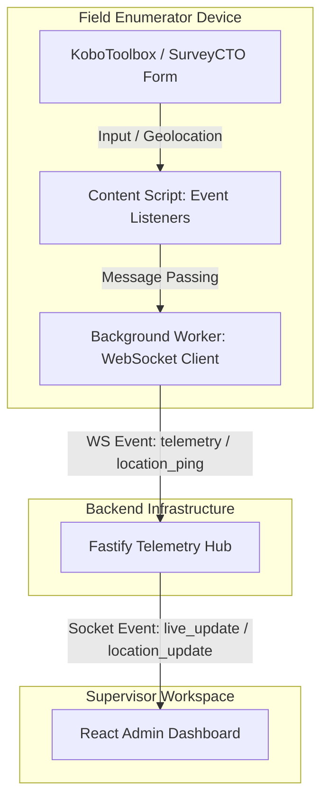

<div align="center">

# 📡 REMT-X

**Real-time quality assurance for field survey teams.**

A three-part system — Chrome extension, WebSocket relay and React dashboard — that lets survey supervisors see live form progress and GPS positions of their enumerators on KoboToolbox and SurveyCTO.

      

**[🔴 Live dashboard](https://remt-x-admin-dashboard-kxet.vercel.app/)**

</div>

## ✨ Highlights

- **Manifest V3 extension** — content script captures form input and geolocation; a visible "REMT-X Active" banner tells the enumerator monitoring is on
- **Hand-rolled Socket.io client** — the service worker speaks the Engine.io packet protocol over a raw WebSocket instead of bundling the Socket.io library, keeping the extension light on battery and bandwidth
- **Room-based relay** — Fastify + Socket.io hub isolates each survey project in its own room
- **Supervisor dashboard** — live form mirroring, enumerator status table, field map and raw event log, with a capped ring buffer to keep the UI responsive
- **Built for real fieldwork** — targets the KoboToolbox and SurveyCTO web forms used in large field surveys

---
REMT-X is a full-stack telemetry and live mirroring system designed for monitoring field research operations on platforms like KoboToolbox and SurveyCTO. The system allows supervisors to monitor active field enumerators in real-time, view live input streams as they type, track real-time GPS locations, and oversee project operations from a centralized supervisor dashboard.

---

## System Architecture

The REMT-X ecosystem consists of three main components:

1. **REMT-X Chrome Extension (Client agent)**: A Manifest V3 extension injected into KoboToolbox and SurveyCTO web forms. It captures geolocated breadcrumbs and input events, transmitting them via a low-overhead WebSocket connection. A visible on-page banner shows the enumerator when REMT-X is active.
2. **REMT-X Telemetry Hub (Relay broker)**: A high-performance Fastify server utilizing Socket.io to manage real-time connections, project rooms, and telemetry broadcasting.
3. **REMT-X Admin Dashboard (Supervisor portal)**: A React-based web application with dashboard statistics, live input mirroring, activity logs, and enumerator tracking.



---

## Tech Stack

### 1. Admin Dashboard (Frontend)
- **Framework**: React 18
- **Build Tool**: Vite, TypeScript
- **Styling**: Tailwind CSS
- **Icons**: Lucide React
- **Animations**: Framer Motion
- **Data Visualization**: Recharts
- **Real-Time Communication**: Socket.io-client

### 2. Telemetry Hub (Backend)
- **Framework**: Fastify (v5)
- **Language**: TypeScript (run via `ts-node` in development)
- **Real-Time Protocol**: Socket.io
- **CORS Management**: `@fastify/cors`

### 3. Chrome Extension (Client Agent)
- **Manifest Version**: 3
- **Script Types**: Content Scripts (DOM monitoring), Service Worker (Background socket client)
- **Network Interface**: Raw WebSocket (Engine.io/Socket.io protocol formatting)
- **Permissions**: `geolocation`, `storage`, and `host_permissions` for matching survey platforms.

---

## Repository Structure

```
projects/app/
├── admin-dashboard/            # React + TypeScript Vite application
│   ├── src/
│   │   ├── App.tsx             # Main dashboard UI & socket connection logic
│   │   ├── main.tsx
│   │   └── index.css
│   ├── package.json
│   ├── tailwind.config.js
│   └── tsconfig.json
├── telemetry-hub/              # Fastify Socket.io server
│   ├── src/
│   │   └── server.ts           # Socket.io connection handlers & event forwarding
│   ├── package.json
│   └── tsconfig.json
├── extension/                  # Chrome Extension source
│   ├── manifest.json           # Extension configuration
│   ├── content.js              # DOM listeners, geolocation tracking, & UI banner injection
│   └── background.js           # Low-bandwidth WebSocket connection manager
├── run-remt-x.bat              # Windows batch script to launch both hub and dashboard
└── .gitignore                  # Project-wide Git ignore rules
```

---

## Component Deep Dive

### 1. Chrome Extension (`extension/`)
- **Content Script (`content.js`)**: Runs on matching survey URLs. Monitors all `<input>`, `<textarea>`, and `<select>` elements for input events. It uses the browser's `navigator.geolocation` API to watch positions with high accuracy, transmitting these coordinates along with input values back to the background worker. Additionally, it injects an unobtrusive banner notifying the enumerator that REMT-X is active and providing a direct link to the dashboard.
- **Background Script (`background.js`)**: Acts as a persistent background service worker. Instead of pulling in the heavy Socket.io client library, it connects using a raw WebSockets interface configured with Socket.io's custom packet protocol standard (e.g., Engine.io handshake packets `"40"`, pings/pongs `"2"`/`"3"`, and event frames `42[...]`). This design minimizes extension overhead and battery usage on mobile devices.

### 2. Telemetry Hub (`telemetry-hub/`)
- **Fastify Server (`server.ts`)**: Initializes a lightweight web server running on port `3001`. It attaches a Socket.io server directly to Fastify's core HTTP engine.
- **Session Management**: Keeps track of active enumerators in a memory-efficient `sessions` map.
- **Room Routing**: Places client agents and dashboard monitors in dedicated rooms based on `projectId` values, ensuring secure data isolation.
- **Event Forwarding**:
  - `join`: Registers users as enumerators or supervisors inside project-specific rooms.
  - `telemetry`: Broadcasts keystroke details (`live_update`) to supervisor rooms.
  - `location_ping`: Forwards geographical fixes (`location_update`) for map rendering.

### 3. Admin Dashboard (`admin-dashboard/`)
- **Views**:
  - **God View**: Shows active sessions with real-time mirroring panels that display field input streams as they occur, alongside GPS coordinate breadcrumbs.
  - **Enumerators**: A tabular list tracking staff statuses, connection durations, and total data captures.
  - **Field Map**: Geolocation tracker visualizing positions and active coordinates.
  - **Live Telemetry**: A raw system event log auditing the real-time websocket feed.
- **State & Connection**: Standard React `useState` hooks receive and aggregate live socket inputs with a capped circular log buffer to ensure UI responsiveness.

---

## Getting Started

### Prerequisites
- Node.js 18 or higher
- Google Chrome or a Chromium-based browser (for extension deployment)

### Running Locally
To launch both the Telemetry Hub and the Admin Dashboard concurrently, use the convenience batch file:
```bash
# Double-click run-remt-x.bat or run it in your terminal:
./run-remt-x.bat
```
*Alternatively, you can start them manually:*

#### Start Telemetry Hub:
```bash
cd telemetry-hub
npm install
npm run dev # Starts on port 3001
```

#### Start Admin Dashboard:
```bash
cd admin-dashboard
npm install
npm run dev # Starts Vite server (typically port 5173)
```

### Loading the Chrome Extension
1. Open Google Chrome and navigate to `chrome://extensions/`.
2. Enable **Developer mode** (top-right toggle).
3. Click **Load unpacked** (top-left button).
4. Select the `extension/` folder inside this repository.
5. The extension will automatically initialize when visiting matches like `https://kf.kobotoolbox.org/*` or `https://*.surveycto.com/*`.

---

## License

This project is licensed under the ISC License.
